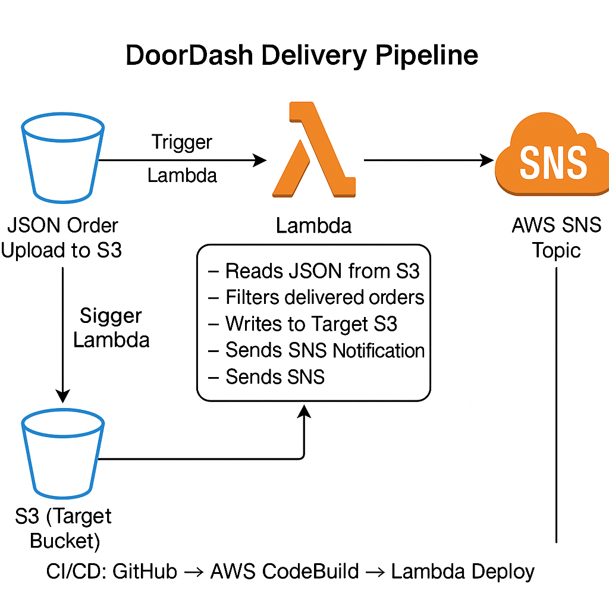

# 🚀 DoorDash Delivery Data Processing Pipeline (AWS Serverless + CI/CD)

This project showcases an end-to-end **serverless data pipeline on AWS** to process DoorDash delivery data using **Lambda**, **S3**, **SNS**, and **CodeBuild CI/CD**, all orchestrated for real-time automation and alerting.

---

## 📌 Project Overview

This solution automates the extraction and filtering of **"delivered"** orders from a JSON dataset uploaded to an S3 bucket and pushes the filtered data to a target bucket while notifying users via **SNS**. The Lambda function is integrated into a **CI/CD pipeline using AWS CodeBuild**.

---

## 🎯 Objectives

- ✅ Automate ingestion and processing of delivery JSON data
- ✅ Filter records with `status = "delivered"`
- ✅ Store clean data in a separate target S3 bucket
- ✅ Send notifications via SNS for pipeline status
- ✅ Enable CI/CD deployment using AWS CodeBuild and GitHub

---

## 🧰 Tech Stack & AWS Services Used

| Tool | Purpose |
|------|---------|
| **AWS S3** | Store raw and filtered JSON files |
| **AWS Lambda** | Serverless processing of delivery data |
| **AWS SNS** | Alert notifications on processing events |
| **AWS IAM** | Role-based permissions for services |
| **AWS CodeBuild** | CI/CD deployment from GitHub |
| **GitHub** | Source code repository |
| **Python 3.11 & Pandas** | Data filtering logic |

---

## 🧱 Architecture Diagram



> 🔁 Upload JSON → 🧠 Lambda (via S3 Trigger) → 📤 Filtered JSON → 🗂️ Target Bucket → 🔔 SNS Notification → ✅ CI/CD Pipeline via GitHub & CodeBuild

---

## 🗃️ Dataset Overview

The sample JSON file contains DoorDash delivery records:
```json
[
  { "id": 1, "status": "delivered", "amount": 20.5, "date": "2024-03-09" },
  { "id": 2, "status": "cancelled", "amount": 15.0, "date": "2024-03-09" },
  ...
]
